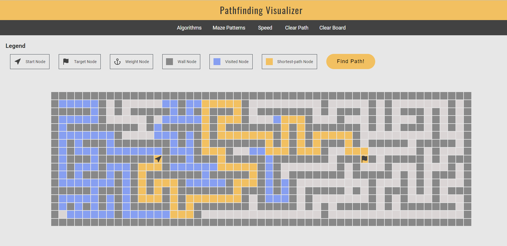

# Pathfinding Application

Welcome to my pathfinding application! I built this project to practice some basic search algorithms I studied in my coursework and observe how they work in an interactive way. You can choose up to 5 search algorithms: BFS, DFS, UCS, Greedy, and A* search.

In addition, I implemented my own version for Recursive Division so that the application can generate different mazes every time you click on the option in the dropdown. Compared to the original algorithm, my version can create more than one pathway to the destination, which is important when trying to understand the power of weighted algorithms such as A* search.

My project was inspired from this [resource](https://github.com/clementmihailescu/Pathfinding-Visualizer) I stumbled upon, but everything I made was built from scratch.

You can test my application [here](https://path-visualizer-tngo.netlify.app).

## Built with

- [React](https://reactjs.org/) - JS library
- Semantic HTML5 markup
- Custom CSS Styling, CSS Flexbox and Grid

## Available Scripts

In the project directory, you can run:

### `npm start`

Runs the app in the development mode.\
Open [http://localhost:3000](http://localhost:3000) to view it in your browser.

The page will reload when you make changes.\
You may also see any lint errors in the console.

### `npm test`

Launches the test runner in the interactive watch mode.\
See the section about [running tests](https://facebook.github.io/create-react-app/docs/running-tests) for more information.

### `npm run build`

Builds the app for production to the `build` folder.\
It correctly bundles React in production mode and optimizes the build for the best performance.

The build is minified and the filenames include the hashes.\
Your app is ready to be deployed!

See the section about [deployment](https://facebook.github.io/create-react-app/docs/deployment) for more information.

### `npm run eject`

**Note: this is a one-way operation. Once you `eject`, you can't go back!**

If you aren't satisfied with the build tool and configuration choices, you can `eject` at any time. This command will remove the single build dependency from your project.

Instead, it will copy all the configuration files and the transitive dependencies (webpack, Babel, ESLint, etc) right into your project so you have full control over them. All of the commands except `eject` will still work, but they will point to the copied scripts so you can tweak them. At this point you're on your own.

You don't have to ever use `eject`. The curated feature set is suitable for small and middle deployments, and you shouldn't feel obligated to use this feature. However we understand that this tool wouldn't be useful if you couldn't customize it when you are ready for it.
